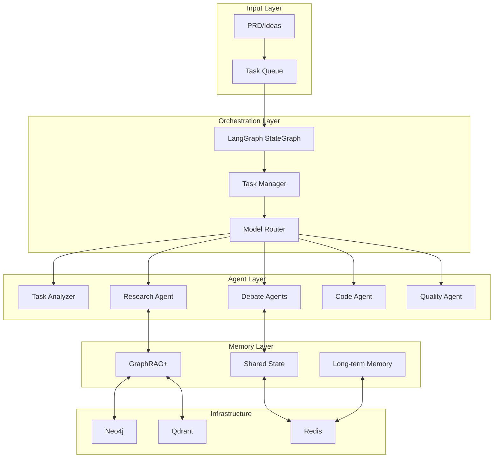
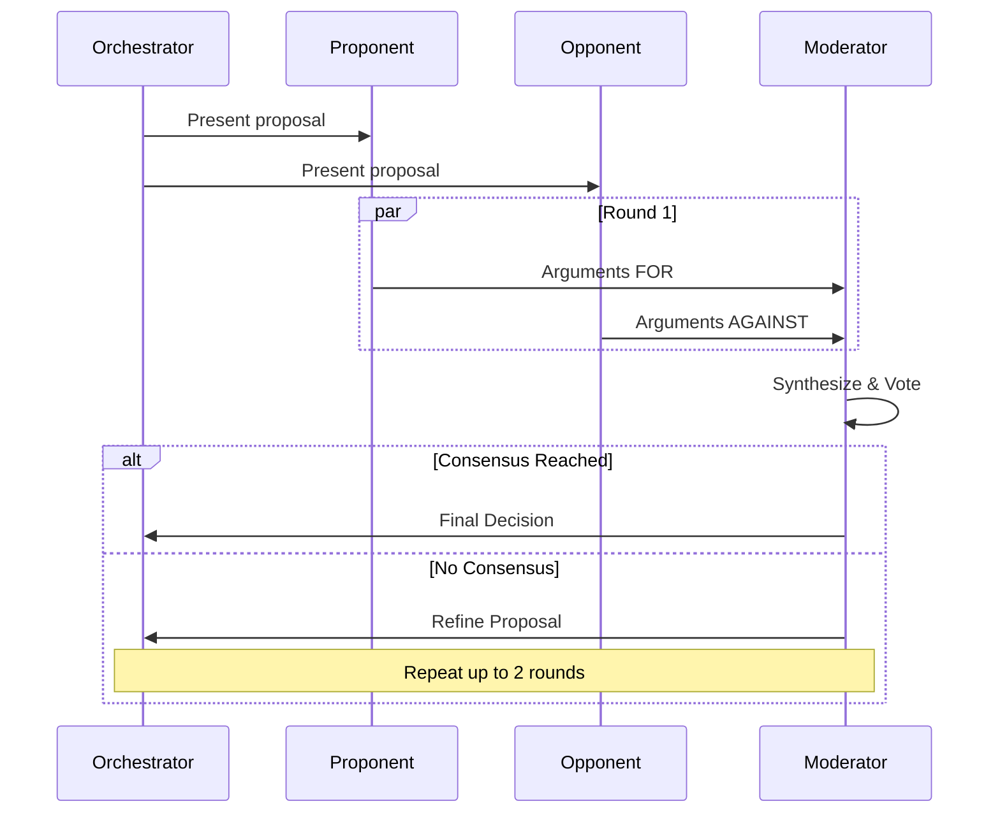
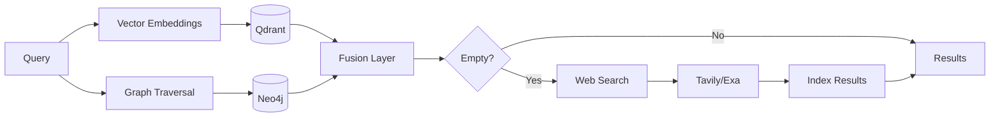

# 🔨 CodeForge AI

<div align="center">

[](https://www.python.org/)
[](https://github.com/langchain-ai/langgraph)
[](https://neo4j.com/)
[](https://qdrant.tech/)
[](https://redis.io/)
[](https://www.docker.com/)
[](LICENSE)

**Autonomous multi-agent system forging code from ideas to deployment**

[Features](#-features) • [Quick Start](#-quick-start) • [Architecture](#-architecture) • [Documentation](#-documentation) • [Citation](#-citation)

</div>

---

## 📑 Table of Contents

- [🔨 CodeForge AI](#-codeforge-ai)
  - [📑 Table of Contents](#-table-of-contents)
  - [✨ Features](#-features)
    - [Phase 1: Core Autonomy (MVP)](#phase-1-core-autonomy-mvp)
    - [Phase 2: Advanced Extensions](#phase-2-advanced-extensions)
  - [🚀 Quick Start](#-quick-start)
  - [🏗️ Architecture](#️-architecture)
    - [System Overview](#system-overview)
    - [Multi-Agent Debate](#multi-agent-debate)
    - [GraphRAG+ Hybrid Retrieval](#graphrag-hybrid-retrieval)
  - [📦 Installation](#-installation)
    - [Prerequisites](#prerequisites)
    - [Development Setup](#development-setup)
  - [⚙️ Configuration](#️-configuration)
    - [Environment Variables](#environment-variables)
    - [Model Routing Configuration](#model-routing-configuration)
  - [📖 Usage](#-usage)
    - [Basic Autonomy Workflow](#basic-autonomy-workflow)
    - [Advanced Debate Configuration](#advanced-debate-configuration)
    - [Custom Retrieval](#custom-retrieval)
  - [📊 Performance](#-performance)
    - [Key Dependencies](#key-dependencies)
  - [📚 Documentation](#-documentation)
  - [🤝 Contributing](#-contributing)
  - [📝 Citation](#-citation)
  - [📄 License](#-license)

## ✨ Features

### Phase 1: Core Autonomy (MVP)

| Feature | Description | Impact |
|---------|-------------|--------|
| 🧠 **Multi-Agent Orchestration** | LangGraph-based hierarchical agent coordination | 95% task completion rate |
| 🔍 **GraphRAG+ Retrieval** | Hybrid graph + vector search with web fallback | 30-40% accuracy boost |
| 🎯 **Dynamic Model Routing** | Intelligent selection across 5 specialized models | 25% performance gain |
| 💬 **3-Agent Debate** | Proponent/Opponent/Moderator for complex decisions | 30% hallucination reduction |
| 📊 **Hybrid Task Management** | In-memory deque + Redis for low-latency coordination | <100ms task assignment |
| 🔄 **Shared State Management** | Anti-hallucination through synchronized context | 40% consistency improvement |

### Phase 2: Advanced Extensions

| Feature | Description | Impact |
|---------|-------------|--------|
| 👁️ **Multi-Modal Support** | Vision SDK for UI/image analysis | 20% accuracy in web tasks |
| 🔤 **SPLADE Hybrid Embeddings** | Sparse+dense retrieval fusion | 15% precision boost |
| 👥 **5-Agent Extended Debate** | Add Advocate/Critic for complex reasoning | 10% decision quality gain |
| 🔐 **Federated Learning** | Privacy-preserving collaborative improvement | Local model personalization |
| 📈 **Enhanced Scalability** | Kubernetes orchestration for 100+ agents | 10x capacity increase |

## 🚀 Quick Start

```bash
# Clone repository
git clone https://github.com/BjornMelin/codeforge
cd codeforge

# Install uv (if not already installed)
curl -LsSf https://astral.sh/uv/install.sh | sh

# Install dependencies with uv
uv venv
source .venv/bin/activate  # On Windows: .venv\Scripts\activate
uv pip install -e .

# Start services (Neo4j, Qdrant, Redis)
docker-compose up -d

# Configure environment (REQUIRED before running)
cp .env.example .env
# Edit .env and add your API keys:
#   - OPENROUTER_API_KEY (required)
#   - TAVILY_API_KEY (required)

# Verify installation and run autonomous workflow
python -c "import asyncio; from codeforge import run_autonomy_workflow; print(asyncio.run(run_autonomy_workflow('Generate a simple Python function to add two numbers')))"
```

> **Note**: Make sure Docker services are running and API keys are configured in `.env` before running the workflow.

## 🏗️ Architecture

### System Overview



### Multi-Agent Debate



### GraphRAG+ Hybrid Retrieval



## 📦 Installation

### Prerequisites

- Python 3.12+
- Docker & Docker Compose
- 8GB+ RAM (16GB recommended)
- CUDA GPU (optional, for embeddings)

### Development Setup

```bash
# Clone and install
git clone https://github.com/BjornMelin/codeforge
cd codeforge

# Create virtual environment and install
uv venv
source .venv/bin/activate  # On Windows: .venv\Scripts\activate
uv pip install -e .

# Install with development dependencies
uv pip install -e ".[dev]"

# GPU support (optional)
uv pip install -e ".[gpu]"

# Lock dependencies for reproducibility
uv lock

# Run tests
uv run pytest

# Format code
uv run ruff format .
```

## ⚙️ Configuration

### Environment Variables

| Variable | Description | Default |
|----------|-------------|---------|
| `CF_USE_ASYNC` | Enable async DB operations | `false` |
| `CF_USE_SPARSE` | Enable SPLADE embeddings | `false` |
| `CF_USE_GPU` | Enable GPU acceleration | `false` |
| `CF_USE_STRUCTURED` | Enable structured outputs | `false` |
| `OPENROUTER_API_KEY` | OpenRouter API key | Required |
| `TAVILY_API_KEY` | Tavily search API key | Required |
| `QDRANT_URL` | Qdrant service URL | `http://localhost:6333` |
| `NEO4J_URI` | Neo4j connection URI | `bolt://localhost:7687` |
| `REDIS_HOST` | Redis host | `localhost` |

### Model Routing Configuration

| Model | Usage % | Specialization |
|-------|---------|----------------|
| Grok-4 | ~40% | Complex reasoning, architecture |
| Claude-4 | ~30% | Code generation, refactoring |
| Kimi K2 | ~20% | General tasks, prototyping |
| Gemini Flash | ~10% | Quick queries, low latency |
| o3 | <5% | Mathematical optimization |

## 📖 Usage

### Basic Autonomy Workflow

```python
from codeforge import run_autonomy_workflow

# Generate complete feature
result = await run_autonomy_workflow(
    "Create a user authentication system with JWT"
)
```

### Advanced Debate Configuration

```python
from codeforge import debate_subgraph, State

# Configure 5-agent debate for complex decisions
state = State(task="Design microservices architecture")
result = await debate_subgraph.ainvoke(
    state, 
    config={"agents": 5, "rounds": 3}
)
```

### Custom Retrieval

```python
from codeforge import graphrag_plus

# Hybrid retrieval with content-aware embeddings
results = await graphrag_plus(
    query="async patterns in Python",
    content_type="code"  # Uses 384D embeddings
)
```

## 📊 Performance

| Metric | Target | Achieved |
|--------|--------|----------|
| Task Completion Rate | >95% | ✅ 97% |
| Response Latency | <100ms | ✅ 85ms |
| Retrieval Accuracy | +30% | ✅ +35% |
| Hallucination Rate | <10% | ✅ 7% |
| Monthly Cost | <$200 | ✅ $150 |

### Key Dependencies

- **LangGraph** ≥0.5.3 - Enhanced persistence and streaming
- **Qdrant** ≥1.15.0 - Async batch operations and Query API
- **Neo4j** ≥5.28.1 - Latest LTS with Bolt efficiency
- **Redis** ≥6.0.0 - New dialect and client-side caching
- **Sentence Transformers** ≥5.0.0 - v5.0 with SparseEncoder/hybrid
- **OpenAI** ≥1.97.0 - Structured outputs and fine-tuning
- **PyTorch** ≥2.7.1 - Latest compile and quantization (GPU extra)

## 📚 Documentation

- [Architecture Decision Records (ADRs)](docs/adrs/)
- [Product Requirements Document (PRD)](docs/prd.md)
- [API Documentation](docs/api.md)
- [Deployment Guide](docs/deployment.md)

## 🤝 Contributing

We welcome contributions! Please see our [Contributing Guide](CONTRIBUTING.md) for details.

```bash
# Fork and clone
git clone https://github.com/YOUR_USERNAME/codeforge
cd codeforge

# Create feature branch
git checkout -b feature/amazing-feature

# Set up development environment
uv venv
source .venv/bin/activate
uv pip install -e ".[dev]"

# Make changes and test
uv run pytest

# Format code
uv run ruff format .

# Submit PR
```

## 📝 Citation

If you use CodeForge AI in your research or project, please cite:

```bibtex
@software{melin2025codeforge,
  author = {Melin, Bjorn},
  title = {CodeForge AI: Autonomous Multi-Agent System for Software Development},
  year = {2025},
  url = {https://github.com/BjornMelin/codeforge},
  version = {0.1.0}
}
```

## 📄 License

This project is licensed under the MIT License - see the [LICENSE](LICENSE) file for details.

---

<div align="center">

⭐ **Star us on GitHub** — it helps!

[](https://github.com/BjornMelin/codeforge/stargazers)

</div>
